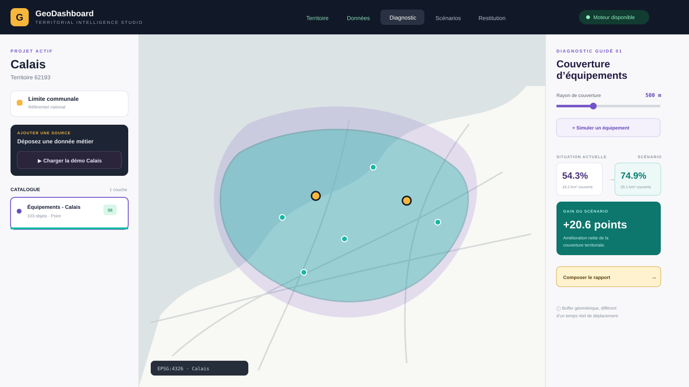
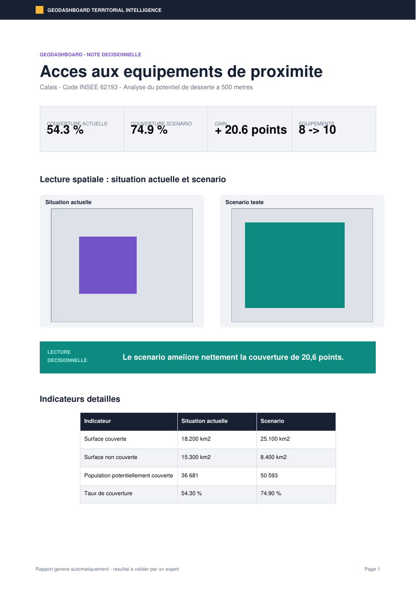
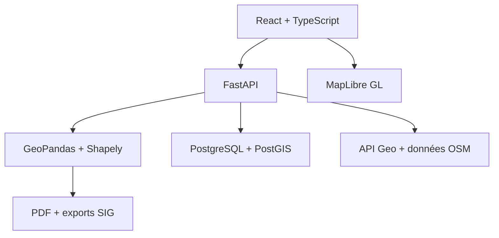

# GeoDashboard - Territorial Intelligence Studio

[](https://github.com/mamadoundiayelo60-hash/GeoDashboard-Territorial-Intelligence/actions)
[](https://www.python.org/)
[](https://react.dev/)
[](https://postgis.net/)
[](LICENSE)

**Explorer un territoire, mesurer ses écarts, simuler une intervention et produire
un livrable décisionnel traçable.**

GeoDashboard est une application SIG full-stack pensée pour les collectivités et les
chargés d'études. Elle ne cherche pas à reproduire QGIS dans un navigateur : elle
organise les traitements géographiques autour d'une question métier et compare une
situation de référence à un scénario d'aménagement.

> **[Tester la démo publique v2](https://geodashboard-studio.onrender.com/)** — déployée
> sur Render depuis [`render.yaml`](render.yaml). L'ancienne preuve de concept Streamlit reste consultable
> sur [geodashboard-sig.streamlit.app](https://geodashboard-sig.streamlit.app/).



## Démonstration en 60 secondes

1. Rechercher **Calais** et choisir la commune portant le code INSEE `62193`.
2. Cliquer sur **Charger la démo Calais** : 103 équipements OSM apparaissent.
3. Choisir la couche ponctuelle et une couverture de 500 mètres.
4. Lancer le diagnostic puis ajouter un équipement hypothétique sur la carte.
5. Comparer les surfaces, le taux et la population potentiellement couverte.
6. Composer un rapport A4/A3 et exporter le résultat en GeoPackage.

Le mot *couverture* désigne ici un buffer euclidien. L'interface rappelle explicitement
qu'il ne s'agit ni d'un temps de trajet ni d'une distance réseau.

## Ce qui différencie le projet

| Capacité | Valeur apportée |
| --- | --- |
| Territoire national | Recherche par commune, code postal ou code INSEE et chargement automatique du contour |
| Diagnostic guidé | Couverture actuelle, secteurs non couverts et estimation de population |
| Scénario cartographique | Implantation hypothétique directement sur la carte et comparaison instantanée |
| Qualité des données | Score, géométries invalides/vides/dupliquées et valeurs manquantes |
| Atelier expert | Expressions sans `eval`, SQL PostGIS read-only et historique reproductible |
| Restitution | Modèles A4/A3, carte vectorielle, PDF, GeoJSON, GeoPackage et manifeste JSON |
| Sécurité | Import borné, ZIP défensif, KML contrôlé, sessions UUID et SQL analysé par AST |

## Aperçu du rapport

[](output/pdf/geodashboard-example-report.pdf)

Le [rapport PDF complet](output/pdf/geodashboard-example-report.pdf) est généré par le
même service que l'application et contrôlé visuellement dans la chaîne de développement.

## Architecture



```text
apps/web          interface, carte et studios métier
apps/api          contrats, contrôles et moteur spatial
database          migrations PostGIS et vues publiées
data/demo         jeu open data stable pour la démonstration
docs              architecture, sécurité et contenus portfolio
infrastructure    images Docker et configuration web
output/pdf        rapport d'exemple versionné
scripts           alimentation open data et génération du rapport
```

## Stack technique

- **Frontend :** React 19, TypeScript, TanStack Query, MapLibre GL, Vite ;
- **API :** FastAPI, Pydantic, HTTPX, SQLAlchemy ;
- **Géomatique :** GeoPandas, Shapely, PyProj, Pyogrio ;
- **Base :** PostgreSQL 16, PostGIS 3.4, index GiST/GIN ;
- **Restitution :** ReportLab, GeoJSON, GeoPackage ;
- **Qualité :** Pytest, Ruff, Mypy, ESLint, Vitest, GitHub Actions ;
- **Déploiement :** Docker Compose et Blueprint Render.

## Données de démonstration

Le fichier [`calais-facilities-osm.geojson`](data/demo/calais-facilities-osm.geojson)
contient 103 écoles, collèges, pharmacies et établissements de santé situés à Calais.
Il a été extrait d'OpenStreetMap le 19 août 2026 avec une requête Overpass bornée au
code INSEE `62193`.

- Source : © contributeurs OpenStreetMap ;
- licence : [ODbL 1.0](https://opendatacommons.org/licenses/odbl/1-0/) ;
- régénération : `python scripts/download_demo_data.py` ;
- usage : démonstration technique, pas inventaire administratif de référence.

Les serveurs Overpass publics peuvent être saturés. Le résultat est donc versionné dans
le dépôt pour préserver la fiabilité de la démonstration.

## Installation locale

Prérequis : Git, Python 3.12, [uv](https://docs.astral.sh/uv/), Node.js 22 et npm.

```bash
git clone https://github.com/mamadoundiayelo60-hash/GeoDashboard-Territorial-Intelligence.git
cd GeoDashboard-Territorial-Intelligence
cp .env.example .env
make install-api install-web
```

Lancer l'API et le frontend dans deux terminaux :

```bash
make api
make web
```

- interface : `http://localhost:5173` ;
- documentation API : `http://localhost:8000/docs` ;
- santé API : `http://localhost:8000/api/v1/health`.

### Installation complète avec PostGIS

```bash
docker compose up --build
```

La base applique automatiquement les migrations, l'API écoute sur le port `8000` et
l'interface sur le port `5173`.

## Tests et qualité

```bash
make lint
make test
```

La version actuelle comprend **30 tests backend**, un test d'interface, des tests
d'injection SQL, de ZIP Slip, d'expressions hostiles, de calcul spatial et de génération
PDF. La couverture backend mesurée est de 80 %.

## Sécurité

- archives limitées à 30 fichiers et 250 Mo décompressés ;
- imports limités à 100 000 entités et 2 millions de coordonnées ;
- refus des chemins ZIP absolus, `..`, liens symboliques et XML actifs ;
- expressions calculées évaluées par une liste blanche d'opérateurs ;
- SQL limité aux vues `geodashboard.v_*`, à 3 secondes et 200 lignes ;
- transaction PostGIS en lecture seule ;
- aucun secret dans le frontend ni dans le dépôt.

Consulter [`SECURITY.md`](SECURITY.md) et le
[modèle de sécurité](docs/security-model.md).

## Déploiement Render

Le fichier [`render.yaml`](render.yaml) décrit :

1. une base PostgreSQL/PostGIS ;
2. l'API Docker FastAPI ;
3. le site statique React.

Après avoir connecté le dépôt à Render avec **New > Blueprint**, renseigner :

- `API_ALLOWED_ORIGINS` avec l'URL HTTPS du site statique ;
- `VITE_API_URL` avec l'URL HTTPS de l'API.

Les offres gratuites sont adaptées à une démonstration portfolio mais peuvent se mettre
en veille. Au moment de cette documentation, une base Render gratuite expire après 30
jours : elle ne constitue donc pas une infrastructure de production durable.

## Roadmap

- distance réseau et isochrones piétons avec moteur de routage ;
- grille carroyée INSEE pour estimer la population couverte ;
- optimisation multicritère d'implantation expliquée ;
- comparaison multi-communale ;
- tuiles vectorielles pour les couches volumineuses ;
- authentification et projets persistants multi-utilisateurs.

## Documentation

- [Spécification produit](docs/product-spec.md)
- [Architecture](docs/architecture.md)
- [Modèle de sécurité](docs/security-model.md)
- [Post LinkedIn](docs/LINKEDIN_POST.md)
- [Texte CV / portfolio](docs/CV_PORTFOLIO.md)
- [Contribuer](CONTRIBUTING.md)

## Auteur

**Mamadou Ndiaye LO** - Géomaticien / Administrateur SIG / Développeur Python

[GitHub](https://github.com/mamadoundiayelo60-hash) · Géomatique · Data Engineering · SIG

## Licence

Code publié sous licence [MIT](LICENSE). Les données OpenStreetMap conservent leur
licence ODbL et leur attribution propre.
