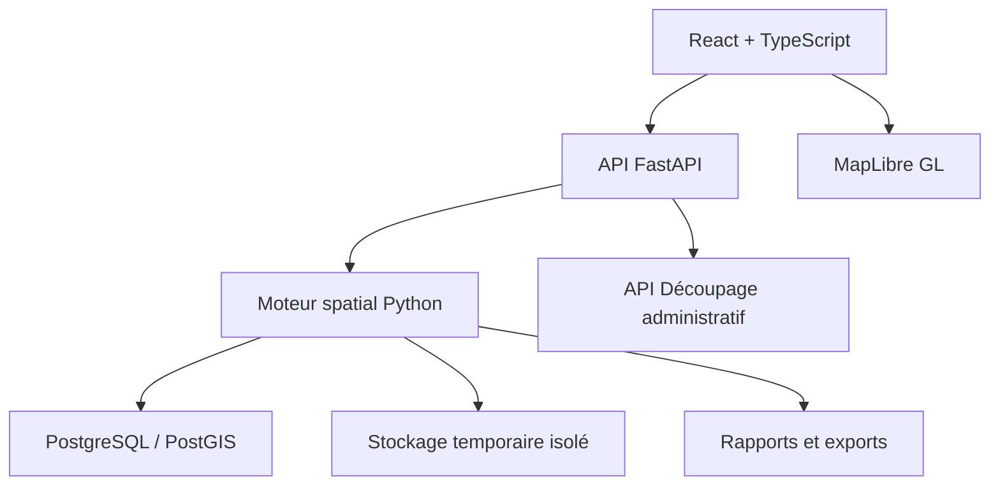

# Architecture livrée

## Vue générale



## Monorepo livré

```text
geodashboard-v2/
├── apps/
│   ├── web/                 React, TypeScript, MapLibre
│   └── api/                 FastAPI et composition des services
├── database/
│   └── migrations/
├── infrastructure/
│   └── docker/
├── data/demo/               données OSM et requête de rapport
├── scripts/                 alimentation et génération reproductible
├── output/pdf/              rapport d'exemple contrôlé
└── docs/
```

## Modèle métier principal

### Project

Territoire actif, couches, styles, requêtes, analyses, scénarios, mises en page et
historique.

### Layer

Source, géométrie, CRS, schéma attributaire, style, métadonnées et état de qualité.

### AnalysisRun

Opération versionnée, entrées, paramètres, sortie, métriques, durée et avertissements.

### Scenario

État de référence plus une ou plusieurs interventions simulées et leurs indicateurs.

### PrintTemplate

Format, blocs, règles de données, thème et version.

## Contrats techniques

- WGS84 pour les échanges cartographiques web ;
- projection métrique adaptée pour les mesures ;
- GeoJSON limité pour les aperçus, formats binaires ou tuiles pour les volumes ;
- traitements lourds hors du cycle HTTP ;
- identifiants opaques pour les ressources temporaires ;
- suppression automatique des fichiers expirés ;
- migrations PostGIS versionnées ;
- journal d'audit structuré.

## Déploiement

Un site React statique, un conteneur API et une base PostGIS sont décrits dans le
Blueprint Render. Le mode démonstration utilise un extrait OSM préchargé et isolé dans
la session ; il reste disponible lorsque le service Overpass est indisponible.
